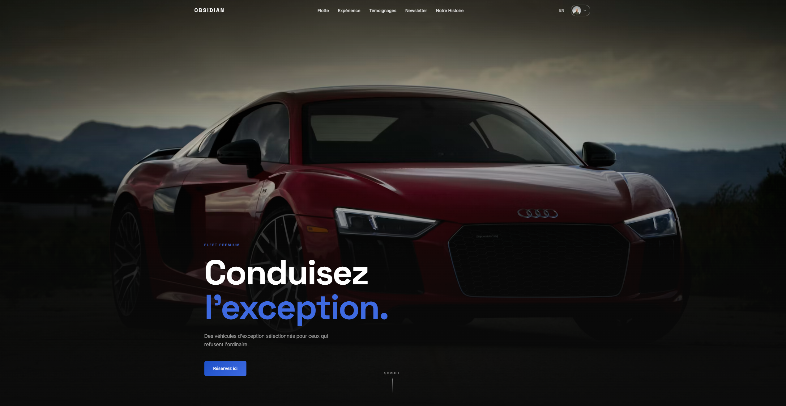

<p align="center">
  
</p>

<h1 align="center">OBSIDIAN</h1>

<p align="center">
  Application web full-stack de location de véhicules premium.<br/>
  Tunnel de réservation complet, paiement Stripe, dashboard admin, bilingue FR/EN.
</p>

<p align="center">
  
  
  
  
  
</p>

---

## Stack technique

| Couche | Technologie |
|--------|-------------|
| Frontend | React 19, React Router v7, CSS Modules |
| Internationalisation | react-i18next — FR / EN |
| Backend / BDD | Supabase (Auth, PostgreSQL, RLS) |
| Paiement | Stripe Checkout + Webhook |
| Serverless | Netlify Functions |
| Email | Resend |
| SEO | react-helmet-async, sitemap, robots.txt, JSON-LD |
| Charts | Recharts |
| Build | Vite 6 |

---

## Fonctionnalités

- **Tunnel de réservation** en 4 étapes — choix véhicule, planning, protection, récapitulatif
- **Calendrier de disponibilité** en temps réel (dates bloquées selon réservations payées)
- **Paiement Stripe** avec session Checkout et webhook de confirmation
- **Email de confirmation** automatique après paiement (Resend)
- **Dashboard admin** — gestion véhicules + réservations, stats, graphique d'activité
- **Espace client** — historique des réservations, profil
- **Synchronisation véhicules** — trigger Supabase + webhook Stripe
- **Authentification** complète (Supabase Auth) avec rôles `admin` / `user`
- **RLS Supabase** — protection des données côté serveur
- **SEO 2026** — meta dynamiques, OG, hreflang, JSON-LD, robots, sitemap
- **Bilingue** FR / EN avec routes traduites (`/reservation` ↔ `/booking`)

---

## Installation

```bash
# Cloner le repo
git clone https://github.com/ton-username/obsidian.git
cd obsidian

# Installer les dépendances
npm install

# Lancer en local (avec Netlify Functions)
npx netlify dev
```

> Le site sera disponible sur `http://localhost:8888`

---

## Structure du projet

```
obsidian/
├── netlify/
│   └── functions/
│       ├── create-checkout.js    # Création session Stripe
│       └── stripe-webhook.js     # Webhook paiement + email
├── public/
│   ├── favicon.svg
│   ├── og-image.png
│   ├── robots.txt
│   └── sitemap.xml
├── src/
│   ├── components/
│   │   ├── AvailabilityCalendar/
│   │   ├── AdminChart/
│   │   ├── Hero/
│   │   ├── Fleet/
│   │   ├── HowItWorks/
│   │   ├── Testimonials/
│   │   ├── Newsletter/
│   │   ├── Navbar/
│   │   ├── Footer/
│   │   ├── SEO/
│   │   └── ProtectedRoute.jsx
│   ├── context/
│   │   └── AuthContext.jsx
│   ├── i18n/
│   │   ├── fr.json
│   │   └── en.json
│   ├── pages/
│   │   ├── Home.jsx
│   │   ├── Booking.jsx
│   │   ├── Dashboard.jsx
│   │   ├── Admin.jsx
│   │   ├── Profile.jsx
│   │   ├── OurStory.jsx
│   │   ├── Login.jsx
│   │   ├── BookingConfirmed.jsx
│   │   ├── PaymentCancelled.jsx
│   │   └── NotFound.jsx
│   └── utils/
│       └── routes.js
└── supabase/
    └── migrations/
        ├── rls_policies.sql
        └── vehicle_availability_trigger.sql
```

---

<p align="center">
  Fait avec React, Supabase & Stripe
</p>
